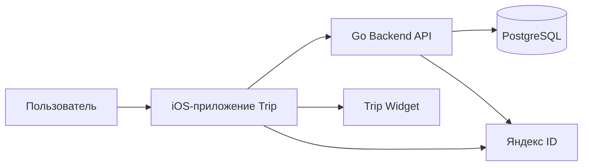

# Архитектура Backend

## Почему modular monolith

Backend выбран как Go modular monolith, потому что продукт находится на ранней стадии, команда маленькая, а домены тесно связаны: поездка, маршрут, расходы, участники и виджет используют одни и те же данные.

Микросервисы сейчас были бы преждевременной сложностью: отдельные деплои, сетевые ошибки, распределенные транзакции и синхронизация данных усложнили бы разработку без ощутимой пользы.

Modular monolith дает середину:

- один процесс и одна база проще для локальной разработки и деплоя;
- доменные границы внутри кода остаются видимыми;
- при росте продукта модули можно будет выделять отдельно;
- транзакции PostgreSQL остаются простыми и надежными.

## Контекст

## Основные части

- `cmd/api`: запуск HTTP API.
- `cmd/migrate`: применение SQL-миграций.
- `internal/platform`: конфигурация, база, HTTP helpers, middleware, logging.
- `internal/itinerary/domain`: расчет занятости расписания.
- `internal/expenses/domain`: деньги, валюты, split-логика.
- `db/migrations`: PostgreSQL schema, seed, новые изменения.
- `api/openapi.yaml`: контракт для iOS и Swagger UI.

## Правила зависимостей

- HTTP handlers принимают request/response и вызывают работу с БД.
- Доменная логика не должна зависеть от HTTP.
- Деньги и расписание считаются в domain-пакетах.
- API DTO не должны подменять доменные модели iOS.

## Транзакции

Транзакции нужны для операций, где меняется несколько таблиц:

- создание поездки, городов, участников и дней;
- создание/обновление расхода и его долей;
- импорт локальных данных;
- будущие приглашения и перенос владельца поездки.

## Безопасность

- Access token короткоживущий.
- Refresh token хранится в базе только в виде hash.
- Пароли локального входа хранятся в hash-виде.
- Яндекс ID проверяется через `login.yandex.ru/info`.
- В production нужно включить обязательную проверку `Authorization` и membership-политики.

## Soft delete

Физическое удаление пользовательских данных не используется для поездок, plan items и expenses. Вместо этого выставляется `deleted_at`. Это позволяет добавить восстановление и снижает риск случайной потери данных.
