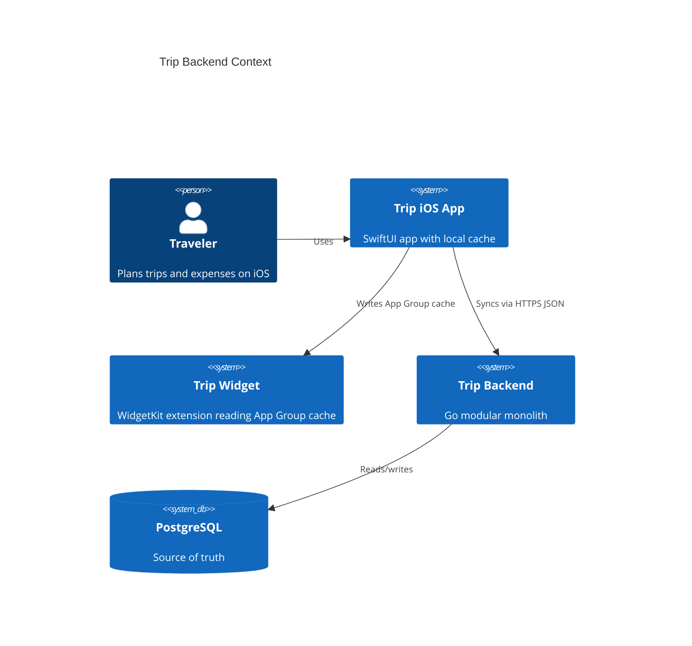
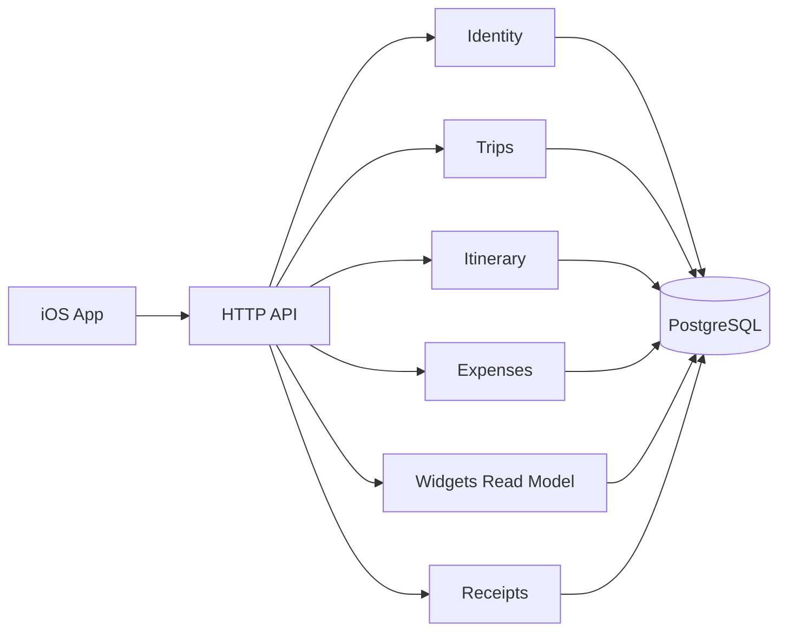

# Backend Architecture

## C4 Context

## C4 Container

## Components

- `internal/platform`: config, database, logging, auth, clock, HTTP helpers.
- `internal/identity`: users, sessions, tokens.
- `internal/trips`: trips, cities, members, invitations, parties, access policy.
- `internal/itinerary`: days, plan items, schedule validation, occupancy.
- `internal/expenses`: money, expense shares, balances, simplified transfers.
- `internal/widgets`: aggregate read-only widget data.
- `internal/receipts`: receipt upload/processing model prepared for later OCR.

## Dependency Rules

- HTTP handlers call application use cases.
- Application layer manages transactions.
- Domain packages contain business rules and have no HTTP/SQL dependencies.
- Repository packages implement storage details.
- API DTOs do not become domain entities.

## Transactions

Transactions are required for trip creation, date-range changes, invitations, ownership transfer, expense/share changes, reorder operations, local imports, and receipt-to-expense conversion.

## Security Model

- User authentication uses short-lived JWT access tokens and hashed refresh tokens.
- Authorization is centralized through trip policies.
- Unknown or unauthorized foreign resources should generally return 404.
- Passwords, refresh tokens, access tokens, invitation tokens, and receipt contents are never logged.

## Offline Strategy

The backend becomes the source of truth, but the iOS app keeps UserDefaults/App Group cache for fast open, temporary offline use, WidgetKit, and gradual migration.
