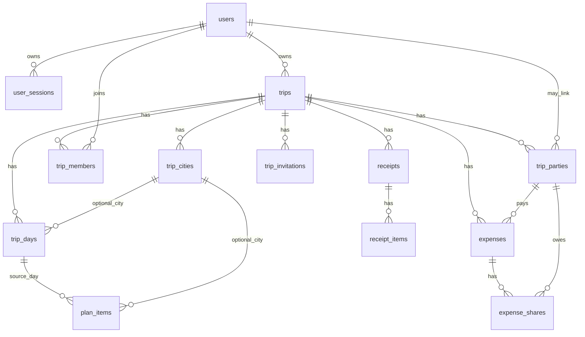

# Current iOS Analysis

This document captures the existing iOS application state before adding a backend. It is based on the current repository files under `Trip/`, `TripWidget/`, `README.md`, and `Trip.xcodeproj`.

## 1. Current iOS Structure

- `Trip/TripApp.swift` starts the SwiftUI app and renders `ContentView`.
- `Trip/ContentView.swift` owns three local stores: `TripStore`, `ExpenseStore`, and `TripCatalogStore`. It switches between the trip catalog and the selected trip workspace.
- `Trip/Features/Trips/TripsViews.swift` implements the local trip catalog, trip cards, and the trip editor.
- `Trip/Features/AppShell/TripWorkspaceViews.swift` implements the selected trip workspace shell and switches between plan and expenses tabs.
- `Trip/Features/Plan/PlanViews.swift` implements calendar, timeline, plan item editor, ticket flags, city selection for a day, route status, and WidgetKit timeline reload triggers.
- `Trip/Features/Expenses/ExpenseViews.swift` implements local expense input, totals, participant filtering, balance view, history, and deletion.
- `Trip/Models.swift` contains the current domain models, local stores, UserDefaults persistence, route scheduling logic, expense calculations, and CBR exchange-rate parsing.
- `Trip/ItineraryData.swift` contains the built-in Europe Trip route and default trip days.
- `Trip/Shared/CitySearchStore.swift` uses `MKLocalSearchCompleter` for city suggestions in the trip editor.
- `TripWidget/TripWidget.swift` implements the WidgetKit extension. It reads Europe Trip days from App Group UserDefaults and falls back to `ItineraryData.days`.
- `Trip.xcodeproj` has two targets: `Trip` and `TripWidget`.

## 2. Found Models And Fields

### Codable domain models

`TripDay`

- `id: Int`
- `date: String`
- `dateKey: String?`
- `city: String`
- `weekday: String`
- `dayOfMonth: Int`
- `items: [PlanItem]`
- Derived: `hasPlan`, `color`

`PlanItem`

- `id: UUID`
- `title: String`
- `city: String`
- `category: PlanCategory`
- `period: String?`
- `startDate: String`
- `startTime: String`
- `endDate: String`
- `endTime: String`
- `sortIndex: Int`
- `needsTicket: Bool`
- `ticketBought: Bool`
- Derived: `hasExactTime`, `hasSchedule`, `timeLabel`

`PlanCategory`

- Cases: `transfer`, `rest`, `walk`, `sight`, `food`, `shopping`
- Localized title and SF Symbol are client presentation concerns.

`TravelTrip`

- `id: UUID`
- `title: String`
- `startDate: Date`
- `endDate: Date`
- `cities: [String]`
- `participants: [String]`

`ExpenseCurrency`

- Cases: `EUR`, `USD`, `RUB`, `GBP`, `TRY`

`ExpenseItem`

- `id: UUID`
- `tripID: UUID?`
- `participantName: String?`
- `involvedParticipantNames: [String]?`
- `title: String`
- `amount: Double`
- `currency: ExpenseCurrency`
- `createdAt: Date`

### Non-Codable / view-helper models

- `PlanItemDraft`
- `TripStop`
- `StopStatus`
- `TimelineSegment`
- `ExpenseBalance`
- `ExpenseSettlement`
- `ExpenseSplitSummary`
- `ExpenseBalanceDraft`
- `ParsedCBRRates`
- `CitySuggestion`
- `EuropeTripStatus`
- `WidgetTripStatus`
- UI-only section/request types such as `TripWorkspaceSection`, `ExpenseSection`, `ExpenseInputField`, `PlanEditorRequest`, `TimelineCardMode`.

## 3. Existing Business Rules

### Trips

- A trip requires a non-empty title, at least one city, and `startDate <= endDate`.
- Cities are unique by exact string in the trip editor.
- Participants are unique by exact string in the trip editor after trimming.
- The default Europe Trip has stable ID `7A835DF2-A238-4C4B-9F36-5DA11A42B40E`.
- User-created trip days are generated from `startDate...endDate`, capped at 370 days.
- If a trip has multiple cities, generated days distribute cities across the date range by index ratio.

### Itinerary

- `TripDay.id` is a local positional integer and is not a stable server identity.
- `TripDay.date` is a localized display string such as `3 июля`.
- `TripDay.dateKey` is the ISO-like key `yyyy-MM-dd` when available.
- `PlanItem.id` is a UUID and can be used as a client-generated ID during import.
- Exact-time items are represented by non-empty `startTime` and/or `endTime`; period items use localized Russian period strings.
- Current period strings are `Утро`, `День`, `Вечер`, `Ночь`.
- `period(for:)` maps hours: `6..<12` morning, `12..<17` day, `17..<22` evening, otherwise night.
- `PlanItem.ticketBought` is forced to `false` when `needsTicket == false`.
- Empty item titles are rejected.
- New items are appended with the next `sortIndex`; reorder normalizes `sortIndex` to array indices.
- Items can be moved between days by changing `startDate`.
- Exact items can cross midnight or span multiple days. If `endTime` is missing, duration defaults to 60 minutes.
- If an end instant is less than or equal to a start instant, the client treats it as crossing into the next day.
- Timeline display clips exact-time activities to the visible day.

### Schedule occupancy

- The client calls this percentage `occupancyPercent`.
- It is schedule occupancy, not completion.
- Active day starts at 08:00 and lasts 15 hours, ending at 23:00.
- Only exact-time activities are counted.
- The current client sums clipped intervals and caps the result to 100%; overlapping activities may be double-counted.
- Backend should expose `schedule_occupancy_percent` and keep `completion_percent` separate if completion is later added.
- Backend should union overlapping intervals, then document the behavior difference in an ADR.

### Expenses

- Expenses require a positive parsed `Double` amount in the UI.
- The payer must be one of the trip participant names.
- The set of involved participants must be non-empty.
- If a title is empty, `ExpenseStore` stores `Трата`.
- Existing participants are plain strings, not users.
- Expenses are filtered by `tripID`. Legacy expenses with `tripID == nil` belong to the default Europe Trip.
- Totals are calculated per currency.
- Approximate RUB total uses cached CBR rates and returns unavailable if a rate is missing.
- Split/balance calculations are separate per currency.
- A shared expense is ignored for split calculations if payer is missing, payer is outside participants, or involved participants are empty.
- Equal split uses `Double`, which can lose minor units. Backend must replace this with integer minor units and deterministic remainder allocation.
- Settlements use deterministic greedy matching by descending amount. This is a simplified transfer list, not a proven global mathematical minimum.

### Widget

- Widget reads only Europe Trip days from App Group UserDefaults.
- Widget falls back to built-in `ItineraryData.days`.
- Widget refresh policy is every 6 hours.
- App triggers `WidgetCenter.shared.reloadTimelines(ofKind: "TripWidget")` when plan data changes or the app appears.
- Widget status reads next city, days until next city, nearest planned day, nearest activity, elapsed route progress, and dates from local day data.

## 4. Current Data Storage

### Standard UserDefaults

- Trips: `trip.catalog.v1`
- Trip days per active trip: `trip.days.editable.v5.<trip_uuid>`
- Legacy default-trip days: `trip.days.editable.v4`
- Expenses: `trip.expenses.v1`
- Exchange rates: `trip.expense.rates.v1`
- Exchange-rate date: `trip.expense.rates.date.v1`

### App Group UserDefaults

- App Group ID: `group.com.alisa.trip`
- Europe Trip days key: `trip.days.shared.europe`
- Both `Trip/Trip.entitlements` and `TripWidget/TripWidget.entitlements` include this group.

### External local dependencies

- City suggestions use MapKit `MKLocalSearchCompleter`.
- Exchange rates are fetched from `https://www.cbr.ru/scripts/XML_daily.asp`.

## 5. Data Belonging To A Trip

- Trip title, date range, ordered cities, local participant names.
- Generated or edited days, including date, city, weekday metadata, and items.
- Plan items, including schedule data, category, ticket flags, city, and ordering.
- Expenses, payer name, involved participant names, currency, amount, and creation date.
- Derived totals, balances, settlements, occupancy, next city, and nearest activity.

## 6. Data Belonging To A User

Currently there is no authenticated user model. Backend must introduce:

- User identity, email, display name, avatar URL.
- Sessions and refresh tokens.
- Trip membership and role.
- Device/session metadata when available.

Existing local `participants: [String]` are trip parties/guest participants, not user accounts.

## 7. Data Read By Widget

Widget currently reads `[TripDay]` for Europe Trip from `trip.days.shared.europe` in `group.com.alisa.trip`.

It derives:

- Next city title.
- Days until next city.
- Next city date/weekday.
- Nearest planned day.
- Nearest plan item title/time/category icon.
- Completed-day route progress.
- Trip date text.
- Unique route summary.

Backend should provide `GET /api/v1/trips/{trip_id}/widget` as an aggregated read model. The iOS app should cache that response into App Group storage; WidgetKit should keep reading locally.

## 8. Models To Change For API Integration

The first iOS integration should avoid replacing domain models with generated DTOs. Add separate networking, repository, DTO mapper, and token store layers.

Models needing migration or wrappers:

- `TravelTrip`: preserve local UUID as `client_id`; add/server-map `server_id`, `version`, `updated_at` in a sync wrapper or repository metadata.
- `TripDay`: map local `id: Int` to server UUID; preserve `date` display string and `dateKey` for local rendering/cache; add `client_id` if needed.
- `PlanItem`: keep local UUID as `client_id`; map localized periods to backend enum values.
- `ExpenseItem`: convert `Double amount` to integer `amount_minor`; map string participants to `trip_parties`.
- `ExpenseCurrency`: continue as ISO 4217 string values.

## 9. Fields To Preserve For Backward Compatibility

- `TravelTrip.id`, `title`, `startDate`, `endDate`, `cities`, `participants`.
- `TripDay.id`, `date`, `dateKey`, `city`, `weekday`, `dayOfMonth`, `items`.
- `PlanItem.id`, `title`, `city`, `category`, `period`, `startDate`, `startTime`, `endDate`, `endTime`, `sortIndex`, `needsTicket`, `ticketBought`.
- `ExpenseItem.id`, `tripID`, `participantName`, `involvedParticipantNames`, `title`, `amount`, `currency`, `createdAt`.
- All current UserDefaults keys until migration is complete.
- App Group ID and Europe days key until WidgetKit switches to cached widget API payload.

## 10. Local IDs To Migrate To Server UUIDs

- `TravelTrip.id: UUID`: can become `client_id`; server `trip_id` must be separate.
- `TripDay.id: Int`: must become server `trip_day_id: UUID`; local ID should be imported as `local_id` or reconstructed by date.
- `PlanItem.id: UUID`: use as `client_id`; server has `plan_item_id`.
- `ExpenseItem.id: UUID`: use as `client_id`; server has `expense_id`.
- `participants: [String]`: create `trip_parties.id` and optionally link to `users.id` later.
- City strings in `TravelTrip.cities` and `TripDay.city`: normalize into `trip_cities.id` plus city name snapshot.

## 11. Swift To Backend Mapping

| Swift model | Backend entity/API concept |
| --- | --- |
| `TravelTrip` | `trips`, `trip_cities`, `trip_parties`, `trip_members` |
| `TravelTrip.cities` | ordered `trip_cities` rows |
| `TravelTrip.participants` | `trip_parties` guest rows; later linked to users |
| `TripDay` | `trip_days` |
| `TripDay.id` | import-only local ID, not server identity |
| `PlanItem` | `plan_items` |
| `PlanItem.period` | `schedule_type=period`, `period=morning/afternoon/evening/night` after localization mapping |
| `PlanItem.startDate/startTime/endDate/endTime` | `schedule_type=exact`, `start_at`, `end_at`, `timezone` |
| `PlanCategory` | `plan_items.category` enum text |
| `ExpenseItem` | `expenses`, `expense_shares` |
| `participantName` | payer `trip_party_id` resolved by display name during import |
| `involvedParticipantNames` | `expense_shares.party_id` rows |
| `ExpenseCurrency` | `currency_code CHAR(3)` |
| `ExpenseBalance` | balances read model |
| `ExpenseSettlement` | `simplified_transfers` read model |
| `WidgetTripStatus` | widget read model endpoint |

## 12. Proposed ER Model

## 13. Proposed Architecture

- Modular monolith in `backend/`.
- Go with `net/http`, `chi`, `pgx`, `sqlc`, SQL migrations, OpenAPI 3.1, `slog`.
- Modules: `identity`, `trips`, `itinerary`, `expenses`, `widgets`, `receipts`.
- Shared platform packages: config, database, logging, auth, clock, HTTP helpers.
- Application layer owns transactions.
- Domain layer owns business rules such as schedule validation, occupancy, money splitting, balances, and policies.
- Repositories expose persistence operations and never silently open nested transactions.
- API DTOs must not be reused as domain models.

## 14. API Resource Map

- Auth: `/api/v1/auth/register`, `/api/v1/auth/login`, `/api/v1/auth/refresh`, `/api/v1/auth/logout`, `/api/v1/me`.
- Trips: `/api/v1/trips`, `/api/v1/trips/{trip_id}`.
- Members and invitations: `/api/v1/trips/{trip_id}/members`, `/api/v1/trips/{trip_id}/invitations`, `/api/v1/invitations/{token}/accept`.
- Days: `/api/v1/trips/{trip_id}/days`, `/api/v1/trips/{trip_id}/days/{day_id}`.
- Plan items: `/api/v1/trips/{trip_id}/plan-items`, `/api/v1/trips/{trip_id}/plan-items/{item_id}`, `/api/v1/trips/{trip_id}/plan-items/reorder`.
- Occupancy: `/api/v1/trips/{trip_id}/schedule-progress`.
- Expenses: `/api/v1/trips/{trip_id}/expenses`, `/api/v1/trips/{trip_id}/expenses/{expense_id}`, `/api/v1/trips/{trip_id}/expense-summary`, `/api/v1/trips/{trip_id}/balances`.
- Widget: `/api/v1/trips/{trip_id}/widget`.
- Import/sync: `/api/v1/import/local-data`, `/api/v1/sync/changes`, `/api/v1/sync/push`.
- Health: `/health/live`, `/health/ready`.

## 15. Migration Plan From UserDefaults

1. Keep all current stores and UserDefaults keys.
2. Add API client, token store, DTOs/mappers, and repository protocols without changing UI behavior.
3. After login, read current `TravelTrip`, `TripDay`, `PlanItem`, and `ExpenseItem` data.
4. Submit data to `POST /api/v1/import/local-data` with local IDs and client UUIDs.
5. Server creates trips, cities, parties, days, items, expenses, and shares transactionally.
6. Server returns local-to-server ID mapping and versions.
7. Client stores migration success and server IDs in a new local metadata key.
8. Server becomes source of truth in a later stage; UserDefaults remains a cache for fast open/offline/widget.

## 16. Migration Risks

- `TripDay.id` is positional and can collide across trips.
- `TripDay.date` is localized; `dateKey` is safer but may be nil in legacy data.
- Periods are localized Russian strings and must be mapped to stable enum values.
- Expense amounts are `Double`; converting to minor units requires currency-specific rounding rules.
- Existing participants are plain names; duplicate names with whitespace/case differences can create ambiguous parties.
- Legacy expenses with `tripID == nil` implicitly belong to Europe Trip.
- Client occupancy may change if backend unions overlapping intervals instead of double-counting them.
- Widget currently expects `[TripDay]`, not a widget API DTO.
- CBR rates are cached client-side as `Double`; server-side currency support should not depend on this cache.
- Existing local data can be partially stale because stores save independently.

## 17. Architecture Problems In Current Client

- Persistence, domain rules, and UI-facing stores are mixed in `Models.swift`.
- Money uses `Double`.
- Participants are strings, which is convenient locally but not enough for collaborative editing.
- Date/time values mix display strings, optional ISO keys, and time strings.
- Widget has duplicated status logic separate from the in-app `EuropeTripStatus`.
- Local stores are independent and do not share a transactional boundary.

## 18. Assumptions

- The backend will initially target the existing iOS app only.
- The default Europe Trip must remain available offline.
- The first backend implementation can use HMAC JWT while keeping the auth layer replaceable.
- PostgreSQL is the only durable backend database for MVP.
- `trip_parties` are required because local expense participants do not have accounts.
- Backend exact schedules require a timezone; imported local data will use the trip timezone if present or a documented fallback.
- Generated Go code can be committed later, but Stage 1 should keep the skeleton simple and compiling before adding generation-heavy flows.
