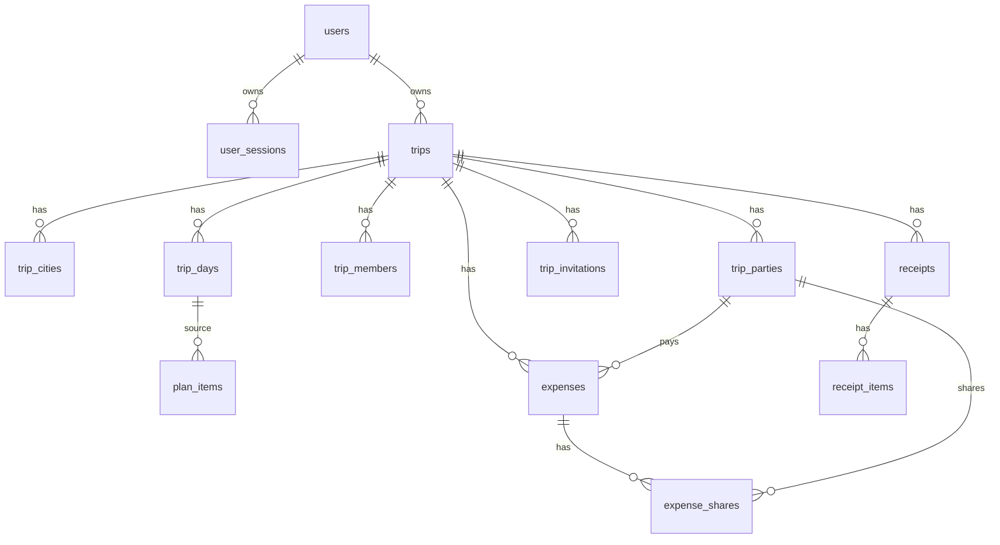

# Backend Domain Model

## Entities

- `User`
- `UserSession`
- `Trip`
- `TripCity`
- `TripMember`
- `TripParty`
- `TripInvitation`
- `TripDay`
- `PlanItem`
- `Expense`
- `ExpenseShare`
- `Receipt`
- `ReceiptItem`

## Invariants

- A trip date range must satisfy `end_date >= start_date`.
- A trip has exactly one logical owner.
- User-created trip ranges are capped at 370 days for parity with the iOS app.
- Plan category is one of `transfer`, `rest`, `walk`, `sight`, `food`, `shopping`.
- Schedule type is `exact`, `period`, or `unscheduled`.
- Exact schedule requires `start_at` and `timezone`; `end_at`, when present, must be after `start_at`.
- If `needs_ticket = false`, `ticket_bought` must be false.
- Money is stored as integer minor units and ISO currency code.
- Supported MVP currencies follow the current iOS app: RUB, EUR, USD, KZT, JPY.
- Expense shares must sum to expense amount in application logic.
- Balances and simplified transfers are calculated separately per currency.

## ER Diagram

## Money Model

Use `amount_minor BIGINT` and `currency_code CHAR(3)`. No `float32` or `float64` in backend money calculations.

## Date And Time Model

- Trip and day dates use PostgreSQL `DATE`.
- Exact activity instants use RFC3339/`TIMESTAMPTZ` plus explicit timezone.
- Period activities use stable enum periods, not localized strings.

## Role Model

- `owner`: full control.
- `editor`: can change trip content, itinerary, and expenses.
- `viewer`: read-only.
