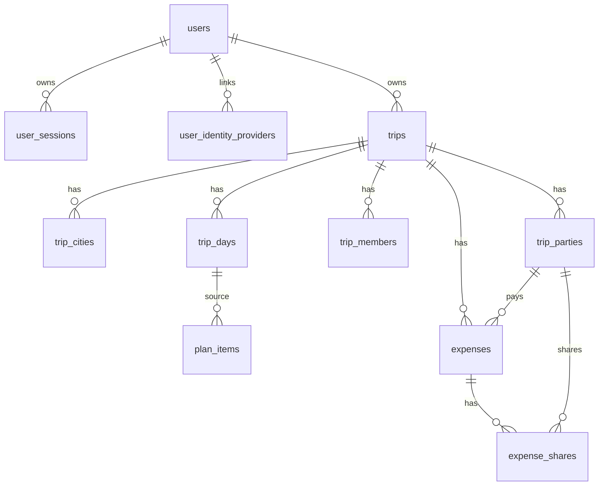

# Доменная модель Backend

## Основные сущности

- `User`: аккаунт пользователя.
- `UserSession`: refresh-сессия пользователя.
- `UserIdentityProvider`: связь пользователя с внешним провайдером, сейчас Яндекс ID.
- `Trip`: поездка.
- `TripCity`: город маршрута.
- `TripMember`: пользователь-участник поездки с ролью `owner/editor/viewer`.
- `TripParty`: гостевой участник расходов, например “Алиса”.
- `TripDay`: день маршрута.
- `PlanItem`: активность, переезд, прогулка, еда или другой элемент плана.
- `Expense`: расход.
- `ExpenseShare`: доля участника в расходе.
- `Receipt` и `ReceiptItem`: заготовка под будущую загрузку чеков.

## Инварианты

- `end_date >= start_date`.
- Деньги хранятся в `amount_minor BIGINT`, без floating point.
- Валюта ограничена текущим набором iOS: `RUB`, `EUR`, `USD`, `KZT`, `JPY`.
- `ExpenseShare` в сумме должны совпадать с `Expense.amount_minor`.
- `PlanItem.category`: `transfer`, `rest`, `walk`, `sight`, `food`, `shopping`.
- `PlanItem.schedule_type`: `exact`, `period`, `unscheduled`.
- Для `exact` нужны `start_at` и `timezone`.
- Если `needs_ticket = false`, то `ticket_bought` тоже должен быть `false`.
- Мягко удаленные записи остаются в базе с `deleted_at`.

## Роли

Системные роли:

- `admin`: администрирование сервиса;
- `user`: обычный пользователь.

Роли внутри поездки:

- `owner`: полный контроль над поездкой;
- `editor`: редактирование маршрута и расходов;
- `viewer`: только просмотр.

Системная роль и роль в поездке не заменяют друг друга. Это разные уровни доступа.

## ER-диаграмма

